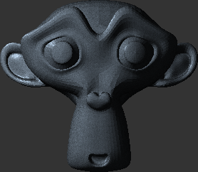

CIS 565 Project 6: Deferred Shader
==================================

* Kai Ninomiya (Arch Linux, Intel i5-2410M)

### [Live Demo](https://kainino0x.github.io/Project6-DeferredShader/)

### [Demo Video](http://youtu.be/15UsLDPgzYw)

Demo image with bloom and SSAO enabled:

Interface
---------

* WASDRF: Fly
* Mouse or arrow keys: rotate camera
* 1: View space positions
* 2: View space normals
* 3: Albedo color
* 4: Depth
* 0: Deferred render, reset to diffuse+specular & SSAO only
  * 6: Disable/enable diffuse+specular
  * 7: Enable/disable bloom
  * 8: Enable/disable toon
  * 9: Disable/enable SSAO

Features
--------

### Diffuse & Specular lighting

This adds a lighting term which includes Lambert diffuse and Blinn-Phong
specular lighting.

### Bloom effect

Sum the entire image with a version blurred using a circular paraboloid.
The result of this is a bloom effect with circular highlights at configurable
radii and with a configurable factor.
(This kernel was chosen because it looks good, is fast to compute, and doesn't
require a convolution kernel texture).

### Toon shading

Toon shading is performed using a ramp shading transformation on the diffuse
and specular color outputs, mapping those [0, 1] ranges using ramp functions:

    input diff  0.00  0.10 0.12  0.60 0.62  1.00
     toon diff  0.00  0.00 0.20  0.20 0.70  0.70

    input spec  0.00  0.10 0.20  1.00
     toon spec  0.00  0.00 1.00  1.00

Toon outlines are added by overwriting pixels with near-tangent view-space
normals. This method doesn't look very good, but avoids the need for additional
outputs to the post-processing stage and is considerably cheaper than a
post-processed effect which reads multiple input pixels.

### Screen-Space Ambient Occlusion

Screen-space ambient occlusion is calculated using a hemisphere method:
pseudorandom points in a center-weighted hemisphere are sampled to find out
whether they are occluded from the camera's perspective. I used John Chapman's
SSAO implementation notes to understand the general sampling methodology, then
implemented it from that understanding.

### G-buffer format optimization

Rearranging the G-buffer formats allows carrying less unnecessary data between
deferred shading stages. Between the render pass and the shading pass, some
optimizations are possible:

| Method | Test render time |
|:------ | ----------------:|
| D, Px Py Pz, Cr Cg Cb, Nx Ny | 10.5 ms |
| D, Px Py Pz Nx, Cr Cg Cb Ny  | 10.0 ms |

Performance
-----------

Tests taken on the initial scene (without developer tools open).

As seen in the data below, removing features at compile time (using
preprocessor flags) gave slightly better performance than disabling at runtime.
The difference is fairly minimal, though (1.5 ms maximum difference).

I suspect the lack of improvement is due to block locality: since the flag is
uniform, all threads in a block will skip, and only a few comparison operations
are introduced into the machine instruction trace.
The source of the slightly decayed performance using runtime flags is probably
compiler optimizations which remove unused varyings. Without code which uses
the textures, less memory access is performed.

### Runtime Flags

| Effects               | Frame time |
|:--------------------- | ----------:|
| No shading            |    10.5 ms |
| Diffuse+specular only |    +0.0 ms |
| Bloom only            |   +69.5 ms |
| Toon only             |    +0.0 ms |
| SSAO only             |    +4.0 ms |
| Bloom & SSAO          |   +74.0 ms |

### Compile-Time Switches

| Effects               | Frame time |
|:--------------------- | ----------:|
| No shading            |     9.0 ms |
| Diffuse+specular only |    +1.5 ms |
| Bloom only            |   +69.5 ms |
| Toon only             |    +0.5 ms |
| SSAO only             |    +5.0 ms |
| Bloom & SSAO          |   +74.5 ms |

References
----------

[1] John Chapman's SSAO implementation notes.
    http://john-chapman-graphics.blogspot.com/2013/01/ssao-tutorial.html

[2] stats.js. Copyright 2009-2012 Mr.doob. Used under MIT License.
    https://github.com/mrdoob/stats.js

Starter Code Acknowledgements
-----------------------------

Many thanks to Cheng-Tso Lin, whose framework for CIS700 we used for this
assignment.

This project makes use of [three.js](http://www.threejs.org).
