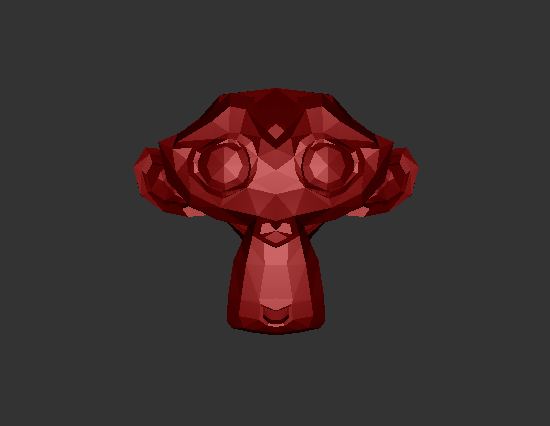
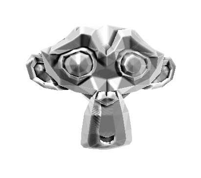

------------------------------------------------------------------------------
CIS565: Project 6 -- Deferred Shader
-------------------------------------------------------------------------------

*Diffuse & Blinn-Phong lighting

Toon Shading

To implement toon shader, I calculated the dot product of the light and the normal of each screen point. Then I assigned different colors according to their dot product value, which is divided into 5 bins. 

Bloom

Screen Space Ambient Occlusion

-------------------------------------------------------------------------------
OVERVIEW:
-------------------------------------------------------------------------------
The deferred shader you will write will have the following stages:

Stage 1 renders the scene geometry to the G-Buffer
* pass.vert
* pass.frag

Stage 2 renders the lighting passes and accumulates to the P-Buffer
* quad.vert
* diffuse.frag
* diagnostic.frag

Stage 3 renders the post processing
* post.vert
* post.frag

The keyboard controls are as follows:
WASDRF - Movement (along w the arrow keys)
* W - Zoom in
* S - Zoom out
* A - Left
* D - Right
* R - Up
* F - Down
* ^ - Up
* v - Down
* < - Left
* > - Right
* 1 - World Space Position
* 2 - Normals
* 3 - Color
* 4 - Depth
* 5 - Diffuse&Blinn-Phong
* 6 - Toon shading
* 7 - Bloom shading
* 0 - Full deferred pipeline

There are also mouse controls for camera rotation.

-------------------------------------------------------------------------------
REQUIREMENTS:
-------------------------------------------------------------------------------

In this project, you are given code for:
* Loading .obj file
* Deferred shading pipeline
* GBuffer pass

You are required to implement:
* Either of the following effects
  * Bloom
  * "Toon" Shading (with basic silhouetting)
* Screen Space Ambient Occlusion
* Diffuse and Blinn-Phong shading

**NOTE**: Implementing separable convolution will require another link in your pipeline and will count as an extra feature if you do performance analysis with a standard one-pass 2D convolution. The overhead of rendering and reading from a texture _may_ offset the extra computations for smaller 2D kernels.

You must implement two of the following extras:
* The effect you did not choose above
* Compare performance to a normal forward renderer with
  * No optimizations
  * Coarse sort geometry front-to-back for early-z
  * Z-prepass for early-z
* Optimize g-buffer format, e.g., pack things together, quantize, reconstruct z from normal x and y (because it is normalized), etc.
  * Must be accompanied with a performance analysis to count
* Additional lighting and pre/post processing effects! (email first please, if they are good you may add multiple).

-------------------------------------------------------------------------------
RESOURCES:
-------------------------------------------------------------------------------

The following are articles and resources that have been chosen to help give you
a sense of each of the effects:

* Bloom : [GPU Gems](http://http.developer.nvidia.com/GPUGems/gpugems_ch21.html) 
* Screen Space Ambient Occlusion : [Floored
  Article](http://floored.com/blog/2013/ssao-screen-space-ambient-occlusion.html)

-------------------------------------------------------------------------------
README
-------------------------------------------------------------------------------
All students must replace or augment the contents of this Readme.md in a clear 
manner with the following:

* A brief description of the project and the specific features you implemented.
* At least one screenshot of your project running.
* A 30 second or longer video of your project running.  To create the video you
  can use [Open Broadcaster Software](http://obsproject.com) 
* A performance evaluation (described in detail below).

-------------------------------------------------------------------------------
PERFORMANCE EVALUATION
-------------------------------------------------------------------------------
The performance evaluation is where you will investigate how to make your 
program more efficient using the skills you've learned in class. You must have
performed at least one experiment on your code to investigate the positive or
negative effects on performance. 

We encourage you to get creative with your tweaks. Consider places in your code
that could be considered bottlenecks and try to improve them. 

Each student should provide no more than a one page summary of their
optimizations along with tables and or graphs to visually explain any
performance differences.

-------------------------------------------------------------------------------
THIRD PARTY CODE POLICY
-------------------------------------------------------------------------------
* Use of any third-party code must be approved by asking on the Google groups.  
  If it is approved, all students are welcome to use it.  Generally, we approve 
  use of third-party code that is not a core part of the project.  For example, 
  for the ray tracer, we would approve using a third-party library for loading 
  models, but would not approve copying and pasting a CUDA function for doing 
  refraction.
* Third-party code must be credited in README.md.
* Using third-party code without its approval, including using another 
  student's code, is an academic integrity violation, and will result in you 
  receiving an F for the semester.

-------------------------------------------------------------------------------
SELF-GRADING
-------------------------------------------------------------------------------
* On the submission date, email your grade, on a scale of 0 to 100, to Harmony,
  harmoli+cis565@seas.upenn.edu, with a one paragraph explanation.  Be concise and 
  realistic.  Recall that we reserve 30 points as a sanity check to adjust your 
  grade.  Your actual grade will be (0.7 * your grade) + (0.3 * our grade).  We 
  hope to only use this in extreme cases when your grade does not realistically 
  reflect your work - it is either too high or too low.  In most cases, we plan 
  to give you the exact grade you suggest.
* Projects are not weighted evenly, e.g., Project 0 doesn't count as much as 
  the path tracer.  We will determine the weighting at the end of the semester 
  based on the size of each project.

---
SUBMISSION
---
As with the previous projects, you should fork this project and work inside of
your fork. Upon completion, commit your finished project back to your fork, and
make a pull request to the master repository.  You should include a README.md
file in the root directory detailing the following

* A brief description of the project and specific features you implemented
* At least one screenshot of your project running.
* A link to a video of your project running.
* Instructions for building and running your project if they differ from the
  base code.
* A performance writeup as detailed above.
* A list of all third-party code used.
* This Readme file edited as described above in the README section.

---
ACKNOWLEDGEMENTS
---

Many thanks to Cheng-Tso Lin, whose framework for CIS700 we used for this
assignment.

This project makes use of [three.js](http://www.threejs.org).
