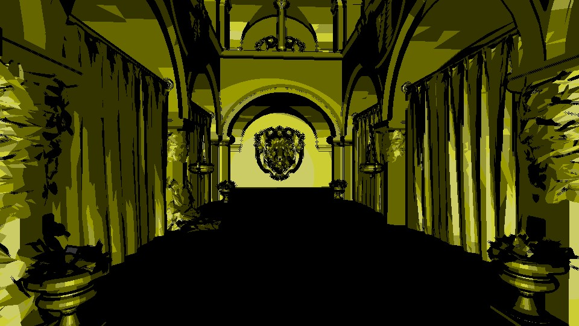
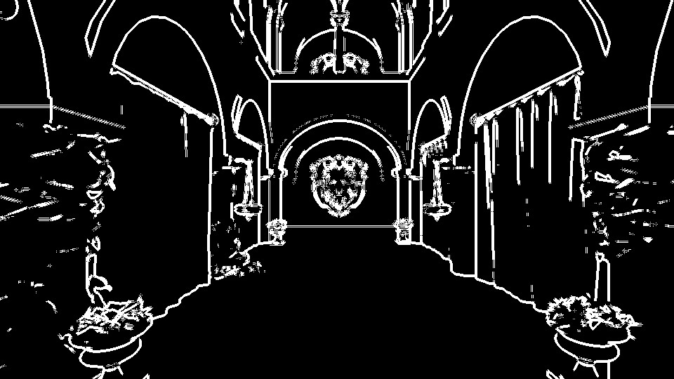
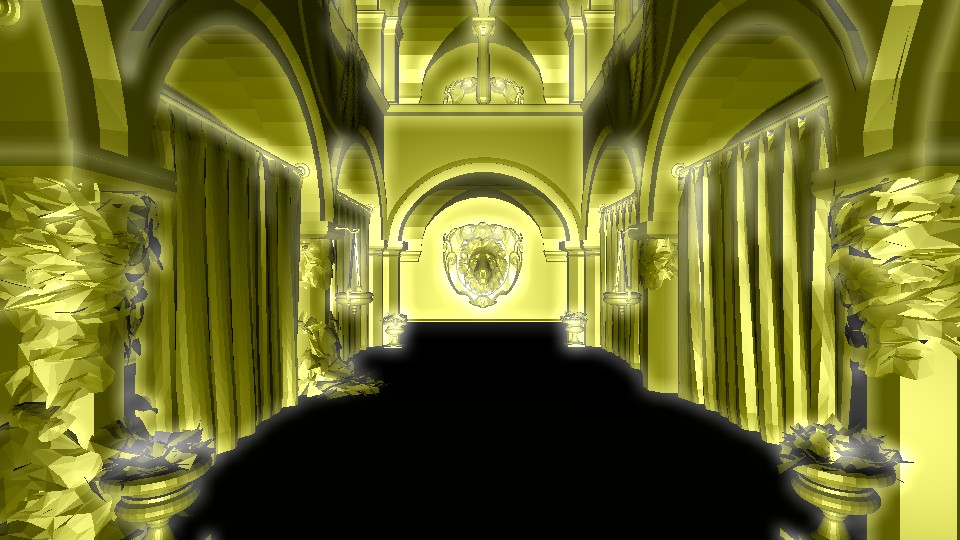
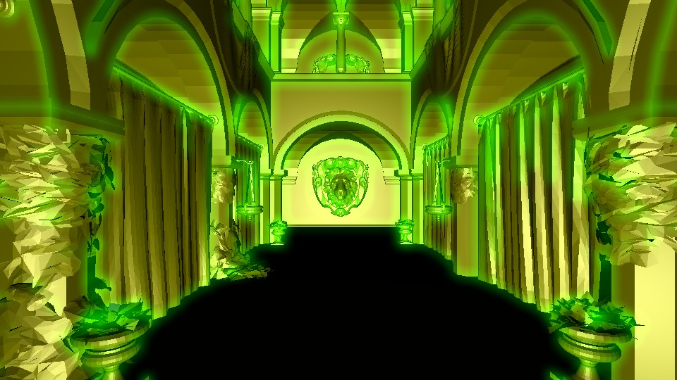
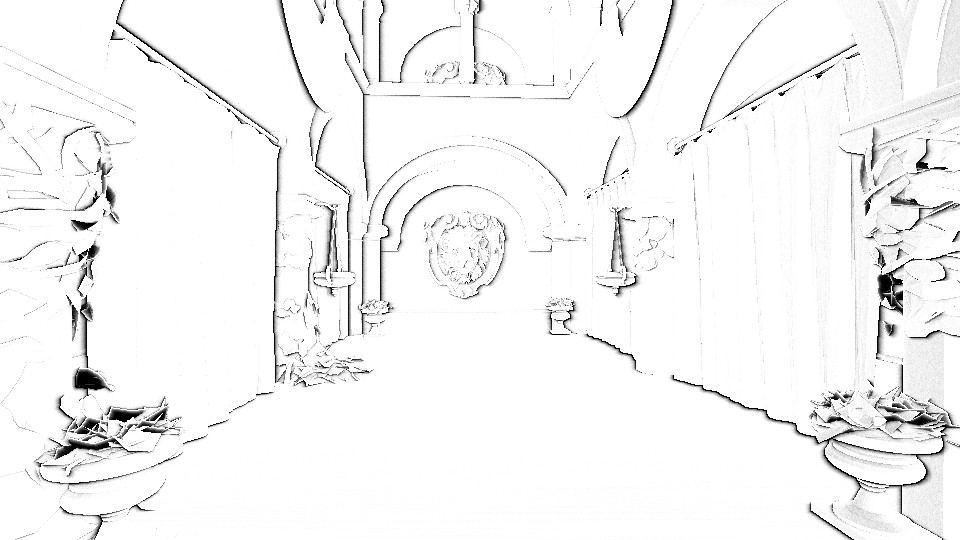
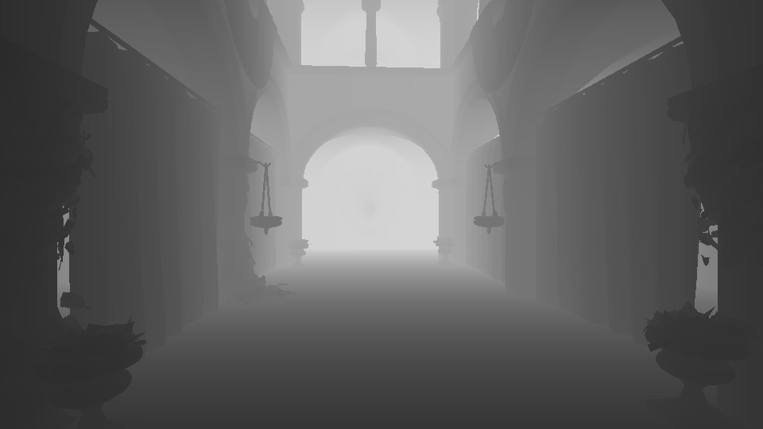

#Deferred Shader
This project is about implementing the deferred shader by using WebGL.  
The features I implemented including 
* Diffuse and Bling shading  
* Bloom shading with separable convolution 
* Toon shading
* Screen space ambient occlusion  
  
User could use number keys to switch between different shading effects.
* '0': Diffuse and bling shading
* '9': Toon shading
* '8': Ambient occlusion
* '7': Bloom shading with separable convolution
* '6': Bloom shading without separable convolution 
* '5': Silhouette image 

#Diffuse and bling shading

#Toon shading
What I did in toon shading is that I tried to create the boundaries or silhouette by finding the place where the normal has enormous change.  
In addition, instead of using the continuous RGB to shade the color, I divided the RGB into 5 segments to make the toon like shading. 

#Bloom
Because the bloom shading needs the alpha value to represent the place where we want to make it glow. However, our model here lacks the alpha information. 
Therefore, I use the silhouettes which I created for toon shading to be my alpha value. The belowing image shows the silhouette which I used to glow my first diffuse_bling shading.  
What different between the white glow image and green glow image is that I used separable convolution to do the bloom for white glow one.

#Screen space ambient occlusion
I followed the tutorial of http://john-chapman-graphics.blogspot.co.uk/2013/01/ssao-tutorial.html to implemente my SSAO. 
What difficult here is to find the appropriate radius to cast our samples. 

#Depth value

#Performance Analysis

When I am doing the experiment, I found something interesting. Because initially I wrote the bloom with separable convolution and bloom without separable convolution in the same shader and using keys to switch 
to different code pathes by passing the uniform integer, and the FPS of these two methods are the same. It's weird for me because the code path without separable convolution 
should have more computation loading than the other one. After I asked Cheng-Tso Lin, he told me that what I found is possible because of the compiling issue. Anyway, in order to 
do this experiment, I eventually wrote the bloom with separable convolution and bloom without separable convolution in two different shader. 

#Video
http://youtu.be/U8ZvzvczlKc

#Reference
Bloom: http://http.developer.nvidia.com/GPUGems/gpugems_ch21.html  
SSAO: http://john-chapman-graphics.blogspot.co.uk/2013/01/ssao-tutorial.html