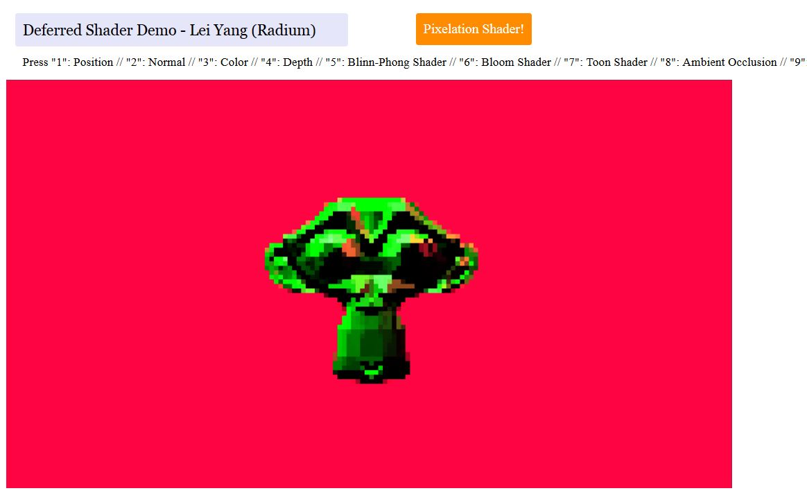

------------------------------------------------------------------------------
CIS565: Project 6 -- Deferred Shader
-------------------------------------------------------------------------------

-------------------------------------------------------------------------------
NOTE:
-------------------------------------------------------------------------------
This project requires any graphics card with support for a modern OpenGL 
pipeline. Any AMD, NVIDIA, or Intel card from the past few years should work 
fine. And it also requires a WebGL capable browser. The project is known to 
have issues with Chrome on windows, but Firefox seems to run it fine.

-------------------------------------------------------------------------------
INTRODUCTION:
-------------------------------------------------------------------------------

In this project, I wrote GLSL and OpenGL code to perform various tasks in a deferred lighting pipeline such as creating and writing to a G-Buffer, and some interesting shaders.

The keyboard controls are as follows:
WASDRF - Movement (along w the arrow keys)
* W - Zoom in
* S - Zoom out
* A - Left
* D - Right
* R - Up
* F - Down
* ^ - Up
* v - Down
* < - Left
* > - Right
* 1 - World Space Position
* 2 - Normals
* 3 - Color
* 4 - Depth
* 5 - Blinn-Phong Shader
* 6 - Bloom Shader
* 7 - Toon Shader
* 8 - Ambient Occlusion
* 9 - Pixelation Shader
* 0 - Frosted Glass Shader

There are also mouse controls for camera rotation.

-------------------------------------------------------------------------------
Feature List:
-------------------------------------------------------------------------------

In this project, I was given code for:
* Loading .obj file
* Deferred shading pipeline
* GBuffer pass

I implemented:
* Bloom Shading
* "Toon" Shading (with basic silhouetting)
* Screen Space Ambient Occlusion
* Diffuse and Blinn-Phong shading
* Pixelation Shading
* Frosted Glass Shading

-------------------------------------------------------------------------------
SHADERS:
-------------------------------------------------------------------------------
#### Blinn-Phong

#### Bloom

reference:
http://prideout.net/archive/bloom/
Guassian Function: http://mathworld.wolfram.com/GaussianFunction.html

#### Toon

reference:
http://en.wikibooks.org/wiki/GLSL_Programming/Unity/Toon_Shading
edge detection: http://www.forceflow.be/2010/04/14/contour-and-valley-detection-using-glsl/

#### Ambient Occlusion (SSAO)

reference:
http://blog.evoserv.at/index.php/2012/12/hemispherical-screen-space-ambient-occlusion-ssao-for-deferred-renderers-using-openglglsl/
http://john-chapman-graphics.blogspot.com/2013/01/ssao-tutorial.html
random function: http://stackoverflow.com/questions/4200224/random-noise-functions-for-glsl

#### Pixelation

reference:
http://www.geeks3d.com/20101029/shader-library-pixelation-post-processing-effect-glsl/

#### Frosted Glass

reference:
http://www.geeks3d.com/20101228/shader-library-frosted-glass-post-processing-shader-glsl/

-------------------------------------------------------------------------------
RUNNING THE CODE:
-------------------------------------------------------------------------------

FIREFOX: change ``strict_origin_policy`` to false in about:config 

-------------------------------------------------------------------------------
PERFORMANCE ANALYSIS:
-------------------------------------------------------------------------------

---
ACKNOWLEDGEMENTS
---

Many thanks to Cheng-Tso Lin, whose framework for CIS700 we used for this
assignment.

This project makes use of [three.js](http://www.threejs.org).
