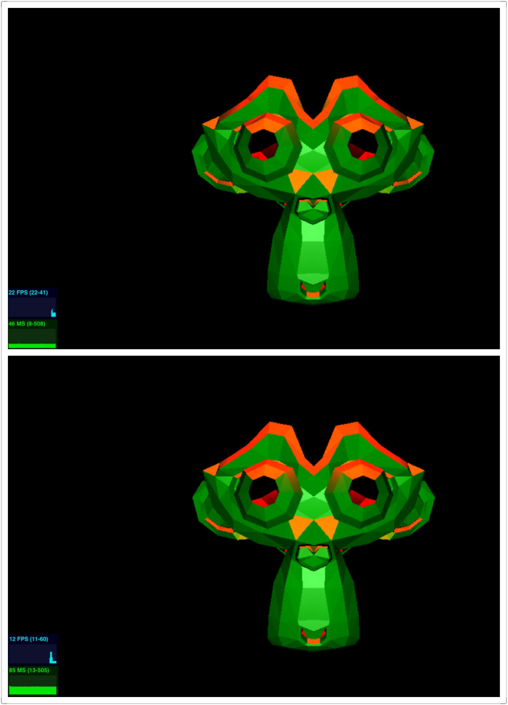

------------------------------------------------------------------------------
CIS565: Project 6 -- Deferred Shader
-------------------------------------------------------------------------------
Jiawei Wang
-------------------------------------------------------------------------------

Overview
-----

In this project, we implemented the deferred shading pipeline with post processing effects, including Toon-Shading, Bloom and multiple lights effect.

Given the pipeline we have all information stored in the g-buffer, including position, normal, color, and depth. We can see these individual buffer as color shown on the diagnostic mode, by pressing keyboard '1', '2', '3', '4' to enable the diagnoses.The post processing special effects are all implemented in the diffuse.frag after the diffuse and phong shading.

Post Processing Special Effects
----------
 - Full deferred pipeline with diffuse and phong shading
    
 
 - Toon Shading
    

 - Bloom Shading
    

 - Multiple Lights (40 lights)
   - Original (60fps)             |  Bloom Effect (27fps)
    :-------------------------:|:-------------------------:
      |  
 

----
Performance
----

I performed the tests for the orignal diffuse shading and bloom shading under multiple lights conditions. 
 - Multiple Lights (200 lights)
   - Original (51fps)             |  Bloom Effect (26fps)
    :-------------------------:|:-------------------------:
      |  

- Comparation (250 lights & 350 lights)
    

- Comparation (500 lights & 1000 lights)
    

From the data collected, we can see the fps drops when bloom shading added and also with the increasing number of lights.

---
ACKNOWLEDGEMENTS
---
Toon Shading Source Description: [toon algorithm](http://www.lighthouse3d.com/tutorials/glsl-tutorial/toon-shader-version-ii/)

This project makes use of [three.js](http://www.threejs.org).
